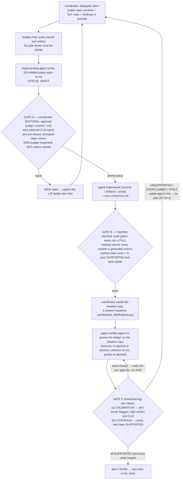

# paper-impl.md — operating the squeeze loop to write an article

Scope: one paper per engagement. The concrete paper is defined by `paper-spec.md`
(authored as item PS0 below); this guide is the loop that writes it. Companion
artifacts: `pycsl-prereqs-impl.md`, `happy-roadmap-impl.md`,
`typing-global-impl.md` (the origin engagements whose discipline this guide
transposes), and the `sl-internal` skill (the generic Squeeze Loop pattern;
companions `sl-builder`, `sl-auditor`, `sl-monitoring-sl`) plus the `write-a-paper`
skill (the generic academic-writing principles this loop's Gate~A enforces).

---

## §0 Why this terrain differs — what the squeeze is made of here

Every prior engagement squeezed an agent between an authority that was already
*on disk* and an execution ground truth that was already *installed*. Writing a
paper inverts the first half: **the upper bound must be fetched from the world
before it can bind anyone.**

- **Upper bound — the state of the art, as a verified corpus.** The authority
  for every statement the paper makes about prior work is the peer-reviewed
  literature itself. The *key rule* of this engagement, stated once and
  enforced everywhere: **each cited peer-reviewed article must have been
  downloaded, read, and analyzed, and its contribution to this paper clearly
  stated** — in a per-source *reading record* (§3) with the archived full
  text, anchored quotes, and the explicit contribution paragraph. An authority
  you have not read is, for this loop, indistinguishable from one you
  invented. Abstracts, secondhand summaries, and the writer's training-memory
  of a paper are not authorities; they are hearsay.
- **Lower bound — tests, measures, experiments, mathematical proofs.** Every
  claim the paper makes about *its own* contribution is bounded from below by
  execution: a re-runnable artifact (script + data + seed + log + result), a
  recomputable measure, or a re-derivable (where possible machine-checkable)
  proof. A number that did not come out of an artifact does not exist; a proof
  step nobody re-derived is a conjecture wearing a theorem's clothes.
- **Dominant failure — writing something inaccurate or false.** The
  manuscript-level coherent-and-wrong: fluent prose that misstates either the
  literature or the evidence. Its named variants (the F-codes of §3): the
  phantom source, the misattribution, the overclaim, the stale number, the
  broken proof step, the secondhand citation, the self-inconsistency, the
  cherry-pick. None of these read as errors; all of them are.
- **Load-bearing gate — re-prove the paper's external claims against
  execution.** Gate C walks the *claim ledger*: every externally visible claim
  in the manuscript, one by one, is re-derived by an agent who did not write
  it — the cited source re-opened at its anchor and judged from the raw text,
  the number re-run to its artifact, the proof step re-checked. The gate is
  calibrated by *seeded falsifications* (§4): a verifier that misses a planted
  error has not verified anything.

Two planes feed one deliverable, and they must never blend. The **literature
plane** (what other papers actually say; ground truth: the downloaded texts)
and the **evidence plane** (what our experiments actually show; ground truth:
execution) both constrain the same manuscript, but a citation never stands in
for an experiment, and an experiment never licenses a sentence about the
literature. The canonical blend, paper edition: "prior work shows X, and our
results confirm it" where the record supports only X′ and the artifact only
X″ — two near-misses fused into one confident falsehood. The no-blend rule has
no external authority; like every such rule before it, it is defended by the
independence of the verifier from the writer.

Strictness has a safe direction, inverted from the verifier engagements: the
manuscript may always claim **less** than the evidence or the source supports
(understatement is legitimate and recorded), never more. Divergence-by-
understatement is a style choice; divergence-by-overclaim is the dominant
failure wearing its best suit.

---

## §1 The agent loop

The convergence loop that closed the origin engagements worked because each
agent had a separate concern and therefore a tailored squeeze. The cast here:

| Agent | Builds | Squeezed from above by | Squeezed from below by | Forbidden move |
|---|---|---|---|---|
| **coordinator** (main thread) | approvals, sequencing, gate verdicts, seed maps | `paper-spec.md` (thesis, contribution list, claim budget, venue constraints) | the gates' machine output: ledger verdicts, build logs, reproduction logs | editing the manuscript, a record, or an artifact; approving a plan it has not amended-or-judged |
| **paper-lit-agent** (upstream, literature plane) | the verified bibliography: one reading record per source — archived full text + hash, anchored claim cards, method, limitations, **contribution-to-this-paper** | the paper-spec's positioning needs: which claims require literature support | **the full texts themselves** — every statement about a source must be anchored to a location in the downloaded document | writing manuscript prose; recording a source it has not downloaded and read in full; paraphrasing from an abstract, a survey, or memory |
| **paper-bench-agent** (evidence plane) | the evidence base: experiments, measures, proofs as re-runnable artifacts (script+data+seed+log+result, hashed) | the paper-spec's claimed contributions — the strongest claim each artifact must demonstrate | execution: pilot runs first, full runs, determinism re-runs, the standing reproduction gate | writing manuscript claims; weakening a claimed contribution to match a failed run (that is a gap doc); touching `verify/` |
| **paper-writer-agent** (the manuscript) | sections of the paper, every externally visible claim tagged `CLM-n` and bound to a claim card or an artifact | the verified reading records + the evidence artifacts — it may state the **strongest sentence they support and nothing more** | the build (compiles; every `\cite` resolves to a record; every number resolves to a generated macro) + **total additivity** of previously verified text | citing without a record; typing a number by hand; editing `bib/` or `evidence/`; filling a gap from its own memory of the literature |
| **paper-verifier-agent** (the load-bearing gate) | per-claim verdicts with the independent re-derivation attached | the manuscript's sentences, exactly as written — nothing else | **raw ground truth**: it re-opens the archived source at the anchor and re-runs the artifact itself | reading the writer's notes or the records' contribution/analysis fields before a verdict; fixing prose or artifacts; negotiating a verdict — **a verdict, never a fix** |

**The squeeze loop strategy bridges the gap between two sources of truth** — a
*hard* truth (the executable lower bound: it runs, it compiles, the number
recomputes, the proof type-checks) and a *soft* truth (the normative upper bound:
the literature and the paper-spec — authoritative, but interpretation-laden).
Every actor above lives on that bridge. The **coordinator's mission is to enforce
this vision across all actors**: as the loop's only judge, it approves no plan and
accepts no item unless the deliverable is a *reading of the soft truth that the
hard truth does not refute* — never the upper bound alone (over-claiming) nor the
lower bound alone (faithful-to-nothing-but-itself). Its editorial judgment at Gate
A and its machine-checked gate verdicts are how the bridge is held; holding it,
across literature, evidence, manuscript, and verification, is the whole of the
coordinator's job.

Three protocol rules, kept verbatim from the origin engagements and extended:

1. **The paired traceability documents and the STATUS handshake.** Forward
   work and reactive gaps both flow through dated pairs:
   - `DD-HHMM-paper-spec-N.md` — the implementing agent's concrete plan for an
     item (or the gap answer), opened at **`STATUS: DRAFT`** → coordinator
     sets **`APPROVED`** (after *editorial* judgment — add, modify, or remove
     parts to speed convergence) → the agent implements, gates run, the
     coordinator sets **`DONE`**.
   - `DD-HHMM-paper-gap-N.md` — written by whichever agent observed the
     divergence: the verifier (a claim fails re-derivation), the lit-agent (a
     source cannot be obtained or contradicts the plan), the bench-agent (a
     run refuses the claimed contribution). Same `DD-HHMM-N` as the spec doc
     that answers it.
   No edit to `paper/`, `bib/`, or `evidence/` ever happens from a `DRAFT`.
   Approval gates the *plan*, the higher-risk half, before any prose.
2. **Author separation is physical, not honorary.** The writer's delegation
   prompt contains the reading records, the generated results macros, and the
   paper-spec sections for its item — never the raw PDFs and never an
   instruction to "recall" the literature. What the writer remembers about a
   source is hearsay; only the record speaks, and the record only speaks where
   it is anchored. Symmetrically, the verifier's prompt contains the
   manuscript, the ledger bindings, and the raw archive — never
   `bib/records/*.md`: the records are the writer's authority; the verifier's
   authority is the source itself. The separation is not hygiene; it is the
   soundness argument for every sentence the paper utters about the world.
3. **No untracked claim; no hand-typed number.** Every externally visible
   claim in the manuscript carries a `CLM-n` tag bound in
   `claims/ledger.tsv`; an orphan claim (tagged but unbound, or assertive but
   untagged) is a Gate B hard fail. Every number in the PDF is produced by a
   generated macro or table under `paper/macros/` whose producer lives in
   `evidence/`; a digit typed by hand is wrong by definition, even when it is
   right.

---

## §2 Subagent definitions

The delegation prompts below ARE the information barriers. The main thread is
the coordinator (subagents cannot spawn subagents); it pastes the relevant §3
rows into every delegation.

```markdown
---
name: paper-lit-agent
description: MUST BE USED to build the verified bibliography for one L-batch.
Downloads, reads in full, and analyzes each candidate source; writes one
reading record per source with archived text, anchored claim cards, and the
contribution-to-this-paper paragraph. Never writes manuscript prose.
tools: Read, Write, Bash, Grep, Glob, WebSearch, WebFetch
model: opus
effort: high
skills: []   # reads PDFs via the Read tool directly (no pdf-reading/file-reading skill installed)
---
The squeeze loop strategy bridges the gap between two sources of truth: a hard,
executable lower bound and a soft, normative upper bound. You build and guard the
**soft upper bound** — the read literature.
You build reading records for one batch of sources. You are given the
paper-spec positioning sections and the candidate list — nothing of the
manuscript. For each source: (1) obtain the full text; archive it under
bib/archive/<bibkey>.pdf and record its SHA-256. A source you cannot obtain
in full text gets verdict UNOBTAINABLE (gap code GP1) and is NOT citable as
support — do not substitute the abstract, a survey's account, or your own
recollection. (2) Read the whole document. (3) Write bib/records/<bibkey>.md:
full citation; acquisition date and hash; claim cards — each a short verbatim
quote (under 25 words) with a section/page anchor plus your paraphrase;
method in three sentences; stated limitations; conflicts with our thesis or
with other records (GP6 — surface them, never resolve them silently); and
the CONTRIBUTION paragraph: why this paper is cited, which of our claims it
supports or opposes, which CLM-IDs will bind to it. A claim card you cannot
anchor to a location does not go in the record. A surprising finding (the
source says the opposite of what the plan assumed) is a
DD-HHMM-paper-gap-N.md, then STOP. You never write or edit anything under
paper/ or evidence/.
```

```markdown
---
name: paper-bench-agent
description: MUST BE USED to build one E-item of the evidence base:
experiments, measures, or machine-checkable proof steps, as re-runnable
artifacts. Pilots before machinery. Never writes manuscript claims.
tools: Read, Write, Edit, Bash, Grep, Glob
model: opus
effort: high
skills: [sl-internal]
---
The squeeze loop strategy bridges the gap between two sources of truth: a hard,
executable lower bound and a soft, normative upper bound. You build and guard the
**hard lower bound** — the executable evidence.
You build the evidence for one claimed contribution. You are given the
paper-spec contribution section (the strongest claim the artifact must
demonstrate) and the evidence/ conventions — nothing of the manuscript.
Hard rules: pilot first — prove the smallest instance end-to-end before any
sweep or harness is built; one claim per experiment; every run is
script+data+seed+log, deterministic on re-run, its headline figures emitted
into paper/macros/results.tex and results tables by the script itself. If
the run refuses the claimed contribution, you do not weaken the claim and
you do not tune until it passes: you write DD-HHMM-paper-gap-N.md
(claimed-vs-observed, minimal reproducer) and STOP — the paper-spec, not the
artifact, is what gets renegotiated, in the open. Proof obligations: encode
every step that can be machine-checked as a script under its E-item; steps
that cannot be are flagged for the verifier's manual re-derivation. You
never edit paper/ prose, bib/, or verify/.
```

```markdown
---
name: paper-writer-agent
description: MUST BE USED to draft or revise one W-section of the manuscript
from APPROVED plans, reading records, and generated results only. Tags every
claim; binds every tag. Never cites without a record; never types a number.
tools: Read, Write, Edit, Bash, Grep, Glob
model: opus
effort: high
skills: [write-a-paper]
---
The squeeze loop strategy bridges the gap between two sources of truth: a hard,
executable lower bound and a soft, normative upper bound. Your deliverable lives
on that bridge — it must be faithful to the soft truth (claim no more than the
records license) and consistent with the hard truth (every number recomputes, the
build is green) at once.
You write exactly one section. You are given: the APPROVED
DD-HHMM-paper-spec-N.md for this section (its planned CLM list), the reading
records it binds to, paper/macros/, and the paper-spec sections — never the
raw PDFs, never the verifier's harness, never an instruction to remember
the literature. Hard rules: every externally visible claim gets \clm{CLM-n}
and a ledger row typed CITE / RESULT / MATH / DEFN / OPN; the sentence
states the strongest thing its binding supports AND NO MORE — when the
record or artifact is not enough for the sentence you want, the sentence is
not written: file DD-HHMM-paper-gap-N.md naming what is missing and STOP
(your memory is not a source); numbers only via \res{...} macros; OPN
sentences are hedged and budgeted per the paper-spec; previously SUPPORTED
text outside your planned diff is byte-stable — if your edit changes a
verified sentence or number without the plan declaring it, your edit is
wrong by definition: revert and redesign. Run the standing reproduction
gate before claiming the item.
```

```markdown
---
name: paper-verifier-agent
description: MUST BE USED to execute Gate C on one item: re-proves every
ledger claim from raw ground truth — re-opens sources at anchors, re-runs
artifacts, re-derives proof steps. Verdicts only; fixes nothing.
tools: Read, Bash, Grep, Glob, Write
model: opus
effort: high
skills: []   # re-opens archived PDFs via the Read tool directly (no pdf-reading skill installed)
---
The squeeze loop strategy bridges the gap between two sources of truth: a hard,
executable lower bound and a soft, normative upper bound. You check the bridge
holds, re-deriving every claim from the hard ground truth (the run) and the raw
source — never the writer's soft account of either.
You verify; you never repair. You are given the (possibly seeded) manuscript
copy, claims/ledger.tsv bindings, bib/archive/, and evidence/ — you do NOT
read bib/records/*.md, the writer's plans, or anyone's notes: your authority
is the source itself and the run itself. Per claim: CITE — open the archived
document at the binding's anchor and judge, from the raw text alone, whether
it supports the sentence as written; RESULT — re-run the bound artifact (or
verify/rerun.sh for its target) and recompute the number; MATH — re-derive
the step, executing its checker script where one exists; DEFN — check
against paper-spec; OPN — check the hedge is present, nothing more. Verdicts:
SUPPORTED / UNSUPPORTED / OVERCLAIMED (true but weaker than stated) /
STALE (artifact or source changed since binding) / UNANCHORED (the anchor
does not contain it). Write Write-access is limited to verify/reports/ and
DD-HHMM-paper-gap-N.md. Every non-SUPPORTED verdict is a gap doc with the
exact sentence, the binding, and your re-derivation. You are calibrated by
sealed seeded falsifications you cannot enumerate: verify every claim as if
it were the seed.
```

---

## §3 Sources of truth per activity

The coordinator includes the relevant rows in each delegation prompt
(subagents start with fresh context).

| Activity | Upper bound (normative) | Lower bound (execution ground truth) | The trap to guard |
|---|---|---|---|
| **PS0 paper-spec** | the venue's CFP/format rules + the thesis the authors actually hold | what the evidence pipeline can demonstrate and the obtainable literature can support — every planned contribution must be *demonstrable by some artifact* | the aspirational contribution: a claim no experiment could ever discharge (F3 at birth) |
| **L-k literature batch** | paper-spec positioning §§ — which of our claims need support or opposition | the downloaded full texts: every card anchored; hash recorded | F1 phantom source; F2 misattribution; F7 secondhand citation (citing X for what survey Y said about X) |
| **E-k evidence item** | paper-spec contribution k — the strongest claim, stated before the run | execution: pilot, full run, determinism re-run, standing reproduction gate | silently weakening the claim to fit the run; a harness "fix" that is really a result change |
| **W-s manuscript section** | the reading records + artifacts bound in the section plan — strongest supported sentence, no more | build green; ledger complete; additivity of verified text; orphan scan = 0 | F3 overclaim; F4 stale number; the two-plane blend ("prior work shows X and we confirm it") |
| **V verification (Gate C)** | the manuscript's sentences, exactly as written | the raw archive at the anchors + the re-runs + the re-derivations | the rubber stamp — measured by the seeded-falsification calibration |
| **W-abstract / camera-ready** | every already-SUPPORTED sentence in the body | the full ledger re-walk on the final PDF | a compression that strengthens: the abstract may only *weaken or restate* verified sentences |

**Repository layout** (created at PS0):

```
paper/        main.tex  sections/  macros/results.tex   <- generated, never hand-edited
claims/       ledger.tsv          CLM-id  TYPE  section  binding  status  date
bib/          records/<bibkey>.md          one reading record per source
              archive/<bibkey>.pdf  SHA256SUMS
evidence/     E-k/run.sh  data/  seeds  logs/  results/
verify/       rerun.sh  seed_falsifications.py  .seeds/  reports/
docs/         DD-HHMM-paper-spec-N.md / DD-HHMM-paper-gap-N.md
```

**Ledger rows** (one per claim; bindings are the verifier's map):

```
CLM-017  CITE    W-sota     knight1986independence@p.99/SecIV    SUPPORTED  2026-06-12
CLM-042  RESULT  W-results  evidence/E-2/results/main.csv#r3c5   SUPPORTED  2026-06-12
CLM-058  MATH    W-method   evidence/E-4/check_lemma2.py         DRAFT      -
CLM-301  OPN     W-disc     paper-spec#position-3 (hedged)       SUPPORTED  2026-06-12
```

**The reading record** (`bib/records/<bibkey>.md`) — the operational form of
the key rule (*downloaded, read, analyzed, contribution stated*):

```
bibkey / full citation / DOI / acquired YYYY-MM-DD / sha256 / read: FULL
CLAIM CARDS   (each: <25-word verbatim quote + page/section anchor + paraphrase)
METHOD        (three sentences)
LIMITATIONS   (the authors' own + ours)
CONFLICTS     (with our thesis or other records -> GP6 entries)
CONTRIBUTION  (why cited; which CLM-IDs it supports or opposes; what the
               paper would lose without it)
```

A record with `read: FULL` absent, a missing hash, or an empty CONTRIBUTION
paragraph blocks every `\cite` of its bibkey at Gate B.

**The dominant failure, enumerated** (every gap doc names its F-code):
F1 phantom source · F2 misattribution · F3 overclaim · F4 stale number ·
F5 broken proof step · F6 self-inconsistency (abstract vs body) ·
F7 secondhand citation · F8 cherry-pick (true number, missing its scope
conditions — every RESULT card carries the conditions under which it holds).

**Residual ledger** (honest scope; one row per code, gated at camera-ready):
GP1 unobtainable source (cut or replaced, never cited blind) · GP2 world-fact
with no possible artifact (must become a CITE or be cut) · GP3 OPN budget
(hedged positions, counted) · GP4 venue/anonymity redactions · GP5 downscoped
experiment (explicit NOT-claim in Limitations) · GP6 contradictory sources
(surfaced in the text, never silently resolved).

---

## §4 The per-item pipeline and the gates



Gate C is where this guide meets its origin. In the verifier engagements,
faithfulness was checked by re-proving external English against a prover;
here it is checked by **re-proving the paper's own external claims against
execution** — the cited source read again by someone who never saw the
writer's interpretation, the number recomputed by someone who never wrote the
sentence. The calibration half exists because the verifier's only failure
mode is agreement: a verification run that would not have caught a planted
falsehood has not verified anything, and the seeds make that measurable per
run rather than assumable.

Item-type specializations: **L-items** gate on record completeness plus a
coordinator spot-check (one card per record re-opened at its anchor);
**E-items** gate on pilot-before-machinery, determinism re-run, and the
claimed-contribution check (the artifact demonstrates the paper-spec claim,
not an adjacent one); **W-items** carry the full pipeline above.

**Connective tissue (every part orients itself).** A section is not done when its
paragraphs are individually correct; it is done when a reader can see *why it exists and
how it relates to the whole*. The relation is **recursive**: a subsection orients itself
within its section, a section within the paper. Concretely, every `\section` and
`\subsection` opens with an **orienting paragraph** --- its role in the bigger picture,
and a preview of its parts --- before it dives into a definition, a sub-header, or any
other environment. Gate A judges whether that orientation is *genuine* (does it really
connect the part to the big picture?); `verify/connective_tissue.py` (a reflexive-squeeze
step) checks the structural *proxy* --- that an orienting paragraph is **present** --- and
loud-fails on any header that dives straight in. The split is the usual one: the
executable check guarantees presence, the editorial gate judges quality. Legitimate
exceptions are carved in `claims/connective_carveouts.tsv`.

**Self-contained (define before use).** A reader must never meet a load-bearing term they
cannot resolve. Every key term is **introduced** (defined or glossed) at or before its
first use in the body; a use that *precedes* the term's definition is admissible only if
it carries a **forward `\ref`** to where the term is defined. (The defect that prompted
this: "the editorial gate (Gate~A)" appeared in a Section-3.1 remark while Gate~A was not
defined until Section~3.3 --- a reader at that point cannot know what it is.) Gate A judges
whether the introduction is *adequate*; `verify/self_contained.py` (a reflexive-squeeze
step) checks the *proxy* --- that a forward use is signposted by a `\ref` to its defining
section --- over a registry of key terms, and loud-fails on an unsignposted forward use.
The abstract is exempt (a summary may name what the body later defines); other exceptions
are carved in `claims/selfcontained_carveouts.tsv`.

**Claim consistency (framing claims may not silently diverge).** The machine gates verify
**evidence-bound** claims (CITE/RESULT). They do not verify mutual consistency of
**interpretive / framing** claims across sections --- e.g. the abstract saying the comparison
is "deferred" while the body reports it executed, or contribution (vi) calling the reflexive
case the "strongest" evidence while the abstract presents two coordinate strands. That is a
**soft-truth vs soft-truth** comparison: there is no executable lower bound that refutes "the
abstract over-emphasizes X," so it cannot be fully mechanized. What *can* be mechanized is a
**growing memory** of caught defects: `verify/claim_consistency.py` (a reflexive-squeeze step)
reads `claims/framing_invariants.tsv` --- `BANNED` phrasings (a previously-caught
coherent-and-wrong framing; fail if it reappears) and `MAX` caps (e.g. no evidence-ranking
superlative may appear more than *n* times). Each framing defect the editorial gate catches is
folded back here as a hard check, so it can never silently return. **Coverage is a floor, not
a ceiling:** a brand-new, unregistered framing defect still escapes --- which is why the next
gate exists.

**Editorial gate (a standing, disjoint Gate A).** The residual the linter cannot cover ---
*is the framing faithful to the evidence?* --- is, by the paper's own thesis (Archetype B,
no external authority), catchable only by **disjoint authority**: an editorial judge who is
not the author. `verify/editorial_gate.py` (a reflexive-squeeze step) does **not** perform
the judgment (that would be the author grading itself); it **enforces that a current disjoint
judgment is on file**: `claims/editorial_review.md` must record a `paper-sha256` matching the
current `tex/paper.tex` (else the review is stale --- the paper changed since it was judged)
and a `verdict` of ACCEPT / ACCEPT-WITH-FIXES. The judge should be **cross-provider or human**;
R3 (the cross-model result) shows a same-provider-family judge shares the author's blind spot,
so a same-family review is recorded as *partial* disjointness. This is the honest operational
form of "internal gates are not complete": you cannot delete the disjoint reviewer, only make
its bookkeeping mechanical. (Live demonstration, circle 119: the disjoint judge caught a
ranking superlative `claim_consistency.py` missed on word order --- the catch was then folded
into the invariants ledger.)

**Cross-provider judge (the gold-standard axis).** `verify/cross_provider_review.py` runs the
disjoint judge on a *genuinely cross-provider* model --- independent pretraining from the
Anthropic author, so it does not share the author's blind spots --- and records
`claims/cross_provider_review.md`. Two backends, honesty-gated (loud SKIP if neither, never
faked): an OpenAI-compatible endpoint (`OPENAI_API_KEY` [+ `CROSS_MODEL`], the *capable* gold
standard) and local Ollama (a different model family without a key, typically *small*). It runs
**controls first** --- a known-contradiction and a known-consistent pair --- and marks any judge
that fails a control as NON-AUTHORITATIVE. This exposes the R3 tradeoff *inside the gate*:
disjointness and capability are different axes. Circle 121 demonstrated it: the only locally
available cross-provider model (`qwen2.5-coder:1.5b-base`, Alibaba) is fully disjoint yet fails
the contradiction control --- so it is recorded as non-authoritative, the operative verdict
stays the capable same-family judge, and `editorial_gate.py` reports the gold standard
(capable + cross-provider) as pending a key. The two judges are complementary: one capable but
same-family, one cross-provider but weak; the gold standard needs both at once.

**Apparatus described (the manuscript names its own gates).** Circle 122 surfaced a third
escaped class --- **code-vs-prose drift**: the gates were extended (circles 119--121) but the
manuscript's description of its apparatus was not, so the paper went coherent-and-wrong about
itself. `claim_consistency.py` (prose-vs-prose) and `editorial_gate.py` (prose-vs-evidence) do
not cover it. `verify/apparatus_described.py` (a reflexive-squeeze step) closes it against
`claims/apparatus_manifest.tsv`, which classifies every script wired into the squeeze as
`described` (the manuscript must `\code`-reference it) or `internal` (mechanics / a writing
principle). The gate fails if (i) a STEPS script is unclassified --- so a **new gate forces a
described/internal decision and cannot enter silently**; (ii) a `described` script is missing
from `tex/paper.tex`; or (iii) the manuscript references a script that is absent or
unclassified. It is a proxy for *named*, not *accurately described* --- accuracy remains the
standing disjoint Gate~A. (The gate classifies itself `internal`, like the other
writing-discipline gates, to avoid a self-describing regress.)

---

## §5 Execution order

Sequenced so each item rides machinery the previous one hardened; parallel
only across chains that share no evidence base and no deliverable.

1. **PS0 — the paper-spec, first and binding.** Thesis; enumerated
   contributions, each with the artifact type that will demonstrate it
   (expressibility check: a contribution no artifact could demonstrate is
   rejected here, not discovered at E-time); positioning needs (what the
   literature must support or oppose); claim budget (including the OPN
   budget); venue constraints; the explicit NOT-claims. *If a draft already
   exists* (revision engagements), PS0 additionally runs the **retro-ledger**:
   every claim in the existing text is tagged, typed, and bound-or-flagged,
   and the existing bibliography is converted to reading records — sources
   never actually read get no record and their citations go ORPHAN until an
   L-item earns them. You cannot verify a manuscript whose claims are not yet
   addressable; transcribe the implicit base before extending it.
2. **E-1 — the flagship contribution's pilot.** Smallest end-to-end instance
   of the central claim, before any sweep or harness. Builds `verify/rerun.sh`
   and the macro-emission convention every later E-item reuses. A pilot that
   refuses the flagship is the cheapest possible discovery and goes straight
   to a gap doc against PS0.
3. **L-1 — the core positioning batch**, in parallel with E-1 (independent
   chains): the sources the thesis lives or dies by, including the closest
   prior work and the strongest known objection (GP6 candidates first, not
   last).
4. **E-2 … E-n / L-2 … L-m** — remaining evidence sequentially by mechanism
   reuse; literature batches in parallel with evidence, never with each
   other's overlapping topics.
5. **W-method, W-results** — first prose, written only over DONE bindings.
   The results section is prose over generated macros; the method section is
   prose over the artifacts' actual procedure (the verifier will re-run it as
   described — a method section the artifact does not implement is F6).
6. **W-sota / W-related** — written from records only; the writer has never
   seen the PDFs, which is precisely why its sentences cannot exceed the
   cards.
7. **W-intro, W-discussion, W-limitations** — the limitations section
   transcribes the GP ledger and the NOT-claims; an empty limitations section
   is a Gate A rejection.
8. **W-abstract — last, always.** The abstract is the densest surface of
   externally visible claims and may only weaken or restate sentences already
   SUPPORTED in the body; a new claim appearing first in the abstract is F6
   by construction.
9. **Camera-ready gate** — the full ledger re-walked on the final PDF with a
   fresh seeding round; the residual GP ledger complete; the bibliography
   100% reading-recorded.

---

## §6 Definition of done

The engagement is done when: every item is at `STATUS: DONE`; the claim
ledger is fully SUPPORTED on the final build — every `CLM` re-derived at
Gate C, every seeded calibration passed; every `\cite` resolves to a reading
record with `read: FULL`, an archived hash, and a stated contribution — the
key rule, discharged for every single source; every number in the PDF
regenerates from `evidence/` via `verify/rerun.sh`, which has passed after
**every** item; the GP residual ledger and the Limitations section agree; and
the paired-document trail is complete — every manuscript change traceable to
an APPROVED spec doc, every spec doc to the paper-spec section or gap that
motivated it.

Do not mark any section done because the writer-agent reported success — and
do not mark the paper done because it reads well: reading well is what the
dominant failure looks like. DONE is the claim ledger fully SUPPORTED, with
the verifier-agent's independent re-derivations — every cited source
re-opened at its anchor, every number re-run to its artifact, every proof
step re-derived — as the witness.
